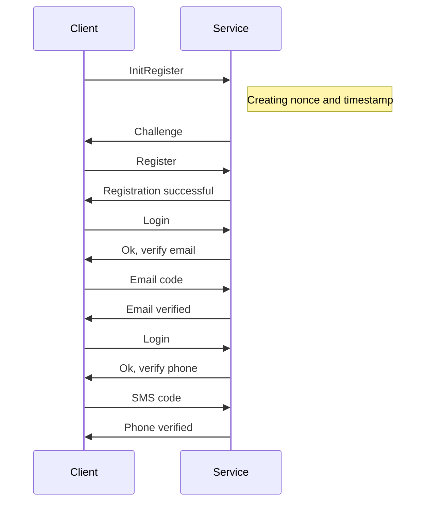
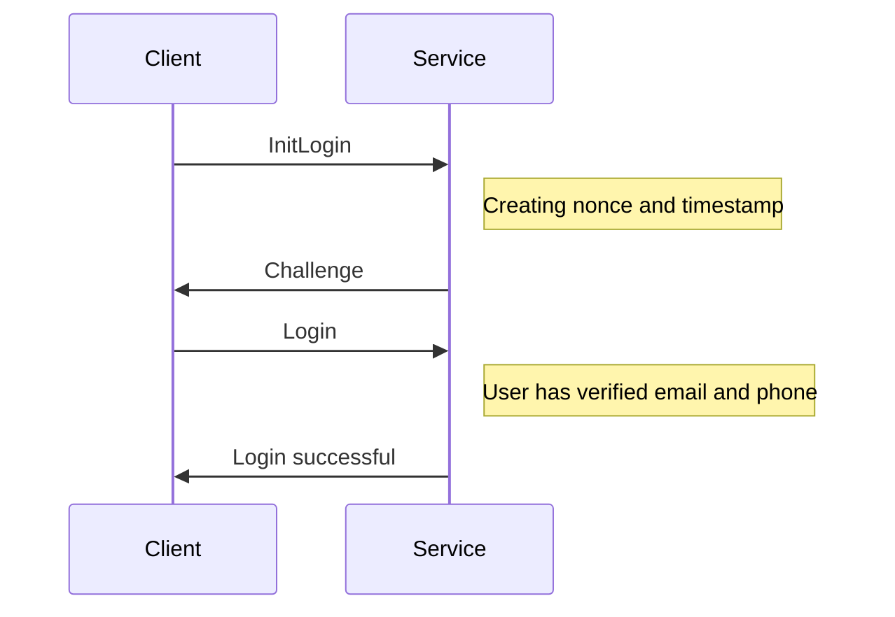
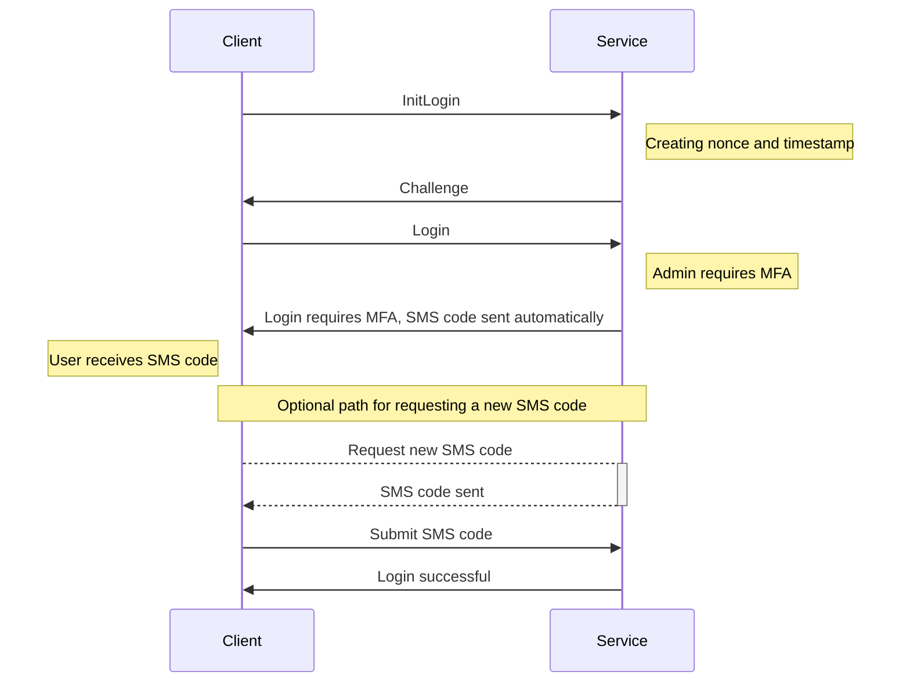

# ISECure JS/TS Client

This is a stateless client side SDK for interacting with ISECure banking file exchange REST API.

## Open API specification

The OpenAPI specification for the REST API service this client interacts with is in the [wsapi_v2.json](wsapi_v2.json) file.

> The master source for wsapi_v2.json is https://isecure.fi/wsapi_v2.json, but we store the copy here for easier reference.

Mandatory features

- User registration with email and phone number verification
- Certificate enrollment
- File listing, downloads, and uploads

Optional features

- Integrator API
- PGP key registration
- Document signing with PGP

## Registering User Example

Example for registering to ISECure SaaS Bank API service test environment.

## Login Example (Data User)

Example of login flow for a data user when both email and phone are already verified.

## Login Example (Admin User with MFA)

Example of login flow for an admin user requiring MFA with SMS verification.

